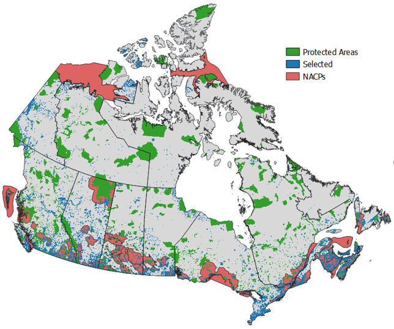

<h2 align="center">Project Evaluation</h2>

This tool is designed to evaluate new `project management plans (PMP)` and their impact
to securing `national conservation features`.

**1)** Explore the achievements layer and view what is currently protected  
**2)** Upload a new PMP and extract conservation features to parcels   
**3)** Compare conservation features between boundaries   
**4)** Download extractions in polygon and table format

<h3>Motivation</h3>
Framed under the lens of resilient landscapes, the aim is to build a protected reserve network that is: 

**C**onnected - so that species habitats and processes can survive  
**A**dequte - so that there is enough high quality habitat for species to persist  
**R**epresentative - so that targeted habitats and important species exist  
**E**ffective - so that protected areas are cost-effective with objectives met  

**Figure 1:** *Prioritization results. Blue areas correspond to ~81.5M hectares and represents lands that would most optimally ensure a resilient landscape.*

<h3>Conservation Features</h3>

Conservation features used for **goal setting** include: species at risk (SAR), endemic and
general biodiversity. 

Conservation features used for **impact measurements** include: key biodiversity areas (KBA),
under-represented areas, climate change resilience, connectivity, direct human pressures, habitat,
carbon, freshwater and access.

*Conservation features have been curated to reflect the national 1km grid standard.* 

<h3>Feedback</h3>
If you have any questions, comments, or concerns with using this application, please feel free to reach out to the **Nat Cons Tech Team**.   
 - Dr. Richard Schuster | [richard.schuster@natureconservancy.ca](mailto:richard.schuster@natureconservancy.ca) 
 - Dan Wismer | [dan.wismer@natureconservancy.ca](mailto:Dan.Wismer@natureconservancy.ca)
 - Andrea Hebb | [andrea.hebb@natureconservancy.ca](mailto:andrea.hebb@natureconservancy.ca)
 - Emily Agar | [emily.agar@natureconservancy.ca](mailto:emily.agar@natureconservancy.ca)
 - Nikol Dimitrov | [nikol.dimitrov@natureconservancy.ca](mailto:nikol.dimitrov@natureconservancy.ca)
